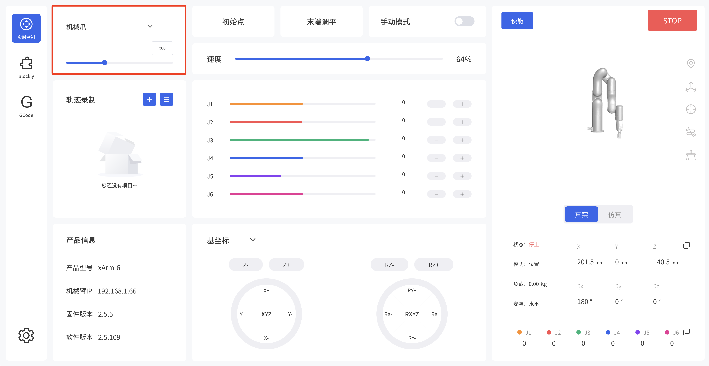

# 3.xArm 机械爪的控制方式
## 3.1.用 xArm Studio控制xArm机械爪

1.控制xArm机械爪

* 在实时控制界面控制xArm机械爪

控制方法：

1）通过拖动进度条来控制机械爪开合的大小。

* 通过Blockly编程来控制xArm机械爪

xArm Gripper.Blockly

这段程序的作用：执行此程序，可控制机械爪在指定位置夹取目标物，然后将目标物放到特定的位置。

注意：

1）当机械爪安装到机械臂上时，在Blockly程序中应当设置TCP负载，当机械爪夹取物体后，其重量发生变化，则需要设置新的TCP负载。

## 3.2.用 Python-SDK 控制xArm机械爪
对于使用Python-SDK控制xArm机械爪的详细内容请见点击下面的链接查看:

https://github.com/xArm-Developer/xArm-Python-SDK/blob/master/example/wrapper/common/5004-set_gripper.py
## 3.3.用 ROS-SDK 控制xArm机械爪

请参照ROS包中附带的ReadMe文件中的第5.7.7节来控制xArm机械爪的打开和关闭。
ROS-SDK下载地址:

https://github.com/xArm-Developer/xarm_ros

## 3.4.用私有TCP协议通信协议控制xArm机械爪

本节主要阐述了如何通过调用xArm控制器的私有TCP协议来控制xArm机械爪。

### 3.4.1.私有TCP协议通信协议

私有TCP协议：

Modbus协议是一项应用层报文传输协议，有ASCII、RTU、TCP三种报文类型。标准Modbus协议物理层接口有RS232、RS422、RS485和以太网接口，采用master/slave方式通信。

私有TCP协议通信过程：

（1）建立TCP连接

（2）准备Modbus报文

（3）使用send命令发送报文

（4）在同一连接下等待应答

（5）使用recv命令读取报文，完成一次数据交换

（6）通信任务结束时，关闭TCP连接

**参数：**

默认TCP端口：502  

协议标识：0x00 0x02 控制(当前只有这一个)

**关于用户使用通信协议组织数据的大小端问题：** 

在本章节中，数据解析均为大端解析。

### 3.4.2.读取xArm机械爪寄存器
#### 3.4.2.1.寄存器功能

|                 | **读取保持寄存器** |                 |                             |
| --------------- | ------------------ | --------------- | --------------------------- |
|                 | **请求指令格式**   |                 |                             |
| Modbus TCP 包头 | 事务标识           | 2 Bytes         | 0x00，0x01                  |
|                 | 协议标识           | 2 Bytes         | 0x00，0x02                  |
|                 | 长度               | 2 Bytes         | 0x00，0x08                  |
|                 | 寄存器             | 1 Byte          | 0x7C                        |
| 参数            | 状态               | 1 Byte          | 0x00                        |
| 内部使用        | 主机 ID            | 1 Byte          | 0x09                        |
| Modbus RTU 数据 | 机械爪 ID          | 1 Byte          | 0x08                        |
|                 | 功能码             | 1 Byte          | 0x03                        |
|                 | 寄存器起始地址     | 2 Bytes         | **Address**                 |
|                 | 寄存器数量         | 2 Bytes         | **N\***                     |
|                 | **响应指令格式**   |                 |                             |
| Modbus TCP 包头 | 事务标识           | 2 Bytes         | 0x00，0x01                  |
|                 | 协议               | 2 Bytes         | 0x00，0x02                  |
|                 | 长度               | 2 Bytes         | **6+N\*x2** |
|                 | 寄存器             | 1 Byte          | 0x7C                        |
|                 | 状态               | 1 Byte          | 0x00                        |
| 内部使用        | 主机 ID            | 1 Byte          | 0x09                        |
| Modbus RTU 数据 | 机械爪 ID          | 1 Byte          | 0x08                        |
|                 | 功能码             | 1 Byte          | 0x03                        |
|                 | 字节数             | 1 Byte          | **N\*x2**                   |
|                 | 寄存器值           | N\*x2 Bytes | **Value**                   |

 
**注：**

N* = 寄存器数量	

Address= 寄存器起始地址（见下面列表）

**寄存器：**

|                | **寄存器起始地址** | **寄存器值** |                                                              |
| -------------- | ------------------ | ------------ | ------------------------------------------------------------ |
| 获取机械爪状态 | 0x0000             | 2bytes       | **停止状态**: 0x0000   **运动状态**: 0x0001 **夹取状态**:  0x0010 |
| 获取机械爪位置 | 0x0702             | 4bytes       | **位置取值范围**: 0xFFFFFFFB-0x00000320                |
| 获取机械爪错误 | 0x000F             | 2bytes       | **有错误**: 其他返回值都代表有错误（除0以外）  **无错误**: 0x0000 |
 
#### 3.4.2.2 示例

**1.获取机械爪状态**

|                 | ****获取机械爪状态****       |         |            |
| --------------- | ---------------------------- | ------- | ---------- |
|                 | **请求指令格式**             |         |            |
| Modbus TCP 包头 | 事务标识                     | 2 Bytes | 0x00，0x01 |
|                 | 协议标识                     | 2 Bytes | 0x00，0x02 |
|                 | 长度                         | 2 Bytes | 0x00，0x08 |
|                 | 寄存器                       | 1 Byte  | 0x7C       |
| 内部使用        | 主机 ID                      | 1 Byte  | 0x09       |
| Modbus RTU 数据 | 机械爪 ID                    | 1 Byte  | 0x08       |
|                 | 功能码                       | 1 Byte  | 0x03       |
|                 | 寄存器起始地址               | 2 Bytes | 0x00，0x00 |
|                 | 寄存器数量                   | 2 Bytes | 0x00，0x01 |
|                 | **响应指令格式**             |         |            |
| Modbus TCP 包头 | 事务标识                     | 2 Bytes | 0x00，0x01 |
|                 | 协议                         | 2 Bytes | 0x00，0x02 |
|                 | 长度                         | 2 Bytes | 0x00，0x08 |
|                 | 寄存器                       | 1 Byte  | 0x7C       |
| 参数            | 状态                         | 1 Byte  | 0x00       |
| 内部使用        | 主机 ID                      | 1 Byte  | 0x09       |
| Modbus RTU 数据 | 机械爪 ID                    | 1 Byte  | 0x08       |
|                 | 功能码                       | 1 Byte  | 0x03       |
|                 | 字节数                       | 1 Byte  | 0x02       |
|                 | 寄存器值（机械爪在运动状态） | 2 Bytes | 0x00，0x01 |

**2.获取机械爪位置**

|                 | **获取机械爪位置**     |         |                     |
| --------------- | ---------------------- | ------- | ------------------- |
|                 | **请求指令格式**       |         |                     |
| Modbus TCP 包头 | 事务标识               | 2 Bytes | 0x00,0x01           |
|                 | 协议                   | 2 Bytes | 0x00,0x02           |
|                 | 长度                   | 2 Bytes | 0x00,0x08           |
|                 | 寄存器                 | 1 Byte  | 0x7C                |
| 内部使用        | 主机 ID                | 1 Byte  | 0x09                |
| Modbus RTU 数据 | 机械爪 ID              | 1 Byte  | 0x08                |
|                 | 功能码                 | 1 Byte  | 0x03                |
|                 | 寄存器起始地址         | 2 Bytes | 0x07,0x02           |
|                 | 寄存器数量             | 2 Bytes | 0x00,0x02           |
|                 | **响应指令格式**       |         |                     |
| Modbus TCP 包头 | 事务标识               | 2 Bytes | 0x00,0x01           |
|                 | 协议                   | 2 Bytes | 0x00,0x02           |
|                 | 长度                   | 2 Bytes | 0x00,0x0A           |
|                 | 寄存器                 | 1 Byte  | 0x7C                |
| 参数            | 状态                   | 1 Byte  | 0x00                |
| 内部使用        | 主机 ID                | 1 Byte  | 0x09                |
| Modbus RTU 数据 | 机械爪 ID              | 1 Byte  | 0x08                |
|                 | 功能码                 | 1 Byte  | 0x03                |
|                 | 字节数                 | 1 Bytes | 0x04                |
|                 | 寄存器值(位置信息:1mm) | 4 Bytes | 0x00,0x00,0x00,0x01 |

**3.获取机械爪错误**

|                 | **获取机械爪错误**     |         |           |
| --------------- | ---------------------- | ------- | --------- |
|                 | **请求指令格式**       |         |           |
| Modbus TCP 包头 | 事务标识               | 2 Bytes | 0x00,0x01 |
|                 | 协议                   | 2 Bytes | 0x00,0x02 |
|                 | 长度                   | 2 Bytes | 0x00,0x08 |
|                 | 寄存器                 | 1 Byte  | 0x7C      |
| 内部使用        | 主机 ID                | 1 Byte  | 0x09      |
| Modbus RTU 数据 | 机械爪 ID              | 1 Byte  | 0x08      |
|                 | 功能码                 | 1 Byte  | 0x03      |
|                 | 寄存器起始地址         | 2 Bytes | 0x00,0x0F |
|                 | 寄存器数量             | 2 Bytes | 0x00,0x01 |
|                 | **响应指令格式**       |         |           |
| Modbus TCP 包头 | 事务标识               | 2 Bytes | 0x00,0x01 |
|                 | 协议                   | 2 Bytes | 0x00,0x02 |
|                 | 长度                   | 2 Bytes | 0x00,0x08 |
|                 | 寄存器                 | 1 Byte  | 0x7C      |
| 参数            | 状态                   | 1 Byte  | 0x00      |
| 内部使用        | 主机 ID                | 1 Byte  | 0x09      |
| Modbus RTU 数据 | 机械爪 ID              | 1 Byte  | 0x08      |
|                 | 功能码                 | 1 Byte  | 0x03      |
|                 | 字节数                 | 1 Byte  | 0x02      |
|                 | 寄存器值（无错误发生） | 2 Bytes | 0x00,0x00 |
### 3.4.3.写入xArm机械爪寄存器

#### 3.4.3.1.寄存器功能*

|                 | **写入寄存器**   |                 |             |
| --------------- | ---------------- | --------------- | ----------- |
|                 | **请求指令格式** |                 |             |
| Modbus TCP 包头 | 事务标识         | 2 Bytes         | 0x00，0x01  |
|                 | 协议             | 2 Bytes         | 0x00，0x02  |
|                 | 长度             | 2 Bytes         | 9+Nx2       |
|                 | 寄存器           | 1 Byte          | 0x7C        |
| 内部使用        | 主机 ID          | 1 Byte          | 0x09        |
| Modbus RTU 数据 | 机械爪 ID        | 1 Byte          | 0x08        |
|                 | 功能码           | 1 Byte          | 0x10        |
|                 | 寄存器起始地址   | 2 Bytes         | **Address** |
|                 | 寄存器数量       | 2 Bytes         | N*     |
|                 | 字节数           | 1 Byte          | **N\*x2**   |
|                 | 寄存器           | N*x2 Bytes | **Value**   |
|                 | **响应指令格式** |                 |             |
| Modbus TCP 包头 | 事务标识         | 2 Bytes         | 0x00，0x01  |
|                 | 协议             | 2 Bytes         | 0x00，0x02  |
|                 | 长度             | 2 Bytes         | 0x00，0x09  |
|                 | 寄存器           | 1 Byte          | 0x7C        |
| 参数            | 状态             | 1 Byte          | 0x00        |
| 内部使用        | 主机 ID          | 1 Byte          | 0x09        |
| Modbus RTU 数据 | 机械爪 ID        | 1 Byte          | 0x08        |
|                 | 功能码           | 1 Byte          | 0x10        |
|                 | 寄存器起始地址   | 2 Bytes         | **Address** |
|                 | 寄存器数量       | 2 Bytes         | **N\***     |

**注：** N* = 寄存器数量

Address= 寄存器起始地址（见下面列表）	
**寄存器：**

|                 | **寄存器起始地址** | **寄存器值** |                                    |
| --------------- | ------------------ | ------------ | ---------------------------------- |
| 设置机械爪模式  | 0x0101             | 2bytes       | 位置模式：0x0000               |
| 使能/关闭机械爪 | 0x0100             | 2bytes       | **使能:** 0x0001  **停用:** 0x0000 |
| 设置机械爪位置  | 0x0700             | 4bytes       | 0xFFFFFFFB-0x00000320              |
| 设置机械爪速度  | 0x0303             | 2bytes       | 0x0000-0x0BB8                      |
#### 3.4.3.2.示例

**1.设置机械爪模式**

|                 | 设置机械爪模式            |         |            |
| --------------- | ------------------------- | ------- | ---------- |
|                 | **请求指令格式**          |         |            |
| Modbus TCP 包头 | 事务标识                  | 2 Bytes | 0x00,0x01  |
|                 | 协议                      | 2 Bytes | 0x00,0x02  |
|                 | 长度                      | 2 Bytes | 0x00,0x0B  |
|                 | 寄存器                    | 1 Byte  | 0x7C       |
| 内部使用        | 主机 ID                   | 1 Byte  | 0x09       |
| Modbus RTU 数据 | 机械爪 ID                 | 1 Byte  | 0x08       |
|                 | 功能码                    | 1 Byte  | 0x10       |
|                 | 寄存器起始地址            | 2 Bytes | 0x01,0x01  |
|                 | 寄存器数量                | 2 Bytes | 0x00,0x01  |
|                 | 字节数                    | 1 Byte  | 0x02       |
|                 | 寄存器（位置模式）0：位置模式1：速度模式 | 2 Bytes | 0x00,0x00  |
|                 | **响应指令格式**          |         |            |
| Modbus TCP 包头 | 事务标识                  | 2 Bytes | 0x00，0x01 |
|                 | 协议                      | 2 Bytes | 0x00，0x02 |
|                 | 长度                      | 2 Bytes | 0x00，0x09 |
|                 | 寄存器                    | 1 Byte  | 0x7C       |
| 参数            | 状态                      | 1 Byte  | 0x00       |
| 内部使用        | 主机 ID                   | 1 Byte  | 0x09       |
| Modbus RTU 数据 | 机械爪 ID                 | 1 Byte  | 0x08       |
|                 | 功能码                    | 1 Byte  | 0x10       |
|                 | 寄存器起始地址            | 2 Bytes | 0x01,0x01  |
|                 | 寄存器数量                | 2 Bytes | 0x00,0x01  |

**2.使能机械爪**

|                 | **使能机械爪** |         |            |
| --------------- | ----------------- | ------- | ---------- |
|                 | **请求指令格式**   |         |            |
| Modbus TCP 包头 | 事务标识          | 2 Bytes | 0x00,0x01  |
|                 | 协议              | 2 Bytes | 0x00,0x02  |
|                 | 长度              | 2 Bytes | 0x00,0x0B  |
|                 | 寄存器            | 1 Byte  | 0x7C       |
| 内部使用        | 主机 ID           | 1 Byte  | 0x09       |
| Modbus RTU 数据 | 机械爪 ID         | 1 Byte  | 0x08       |
|                 | 功能码            | 1 Byte  | 0x10       |
|                 | 寄存器起始地址     | 2 Bytes | 0x01,0x00  |
|                 | 寄存器数量        | 2 Bytes | 0x00,0x01  |
|                 | 字节数            | 1 Byte  | 0x02       |
|                 | 寄存器（使能机械爪) | 2 Bytes | 0x00,0x01  |
|                 | **响应指令格式**   |         |            |
| Modbus TCP 包头 | 事务标识          | 2 Bytes | 0x00，0x01 |
|                 | 协议              | 2 Bytes | 0x00，0x02 |
|                 | 长度              | 2 Bytes | 0x00，0x09 |
|                 | 寄存器            | 1 Byte  | 0x7C       |
| 参数            | 状态              | 1 Byte  | 0x00       |
| 内部使用        | 主机 ID           | 1 Byte  | 0x09       |
| Modbus RTU 数据 | 机械爪 ID         | 1 Byte  | 0x08       |
|                 | 功能码            | 1 Byte  | 0x10       |
|                 | 寄存器起始地址     | 2 Bytes | 0x01,0x00  |
|                 | 寄存器数量        | 2 Bytes | 0x00,0x01  |

**3.设置机械爪速度**

|                 | **设置机械爪速度**            |         |            |
| --------------- | ----------------------------- | ------- | ---------- |
|                 | **请求指令格式**              |         |            |
| Modbus TCP 包头 | 事务标识                      | 2 Bytes | 0x00,0x01  |
|                 | 协议                          | 2 Bytes | 0x00,0x02  |
|                 | 长度                          | 2 Bytes | 0x00,0x0B  |
|                 | 寄存器                        | 1 Byte  | 0x7C       |
| 内部使用        | 主机 ID                       | 1 Byte  | 0x09       |
| Modbus RTU 数据 | 机械爪 ID                     | 1 Byte  | 0x08       |
|                 | 功能码                        | 1 Byte  | 0x10       |
|                 | 寄存器起始地址                | 2 Bytes | 0x03,0x03  |
|                 | 寄存器数量                    | 2 Bytes | 0x00,0x01  |
|                 | 字节数                        | 1 Byte  | 0x02       |
|                 | 寄存器（设置速度为1500r/min） | 2 Bytes | 0x05,0xDC  |
|                 | **响应指令格式**              |         |            |
| Modbus TCP 包头 | 事务标识                      | 2 Bytes | 0x00，0x01 |
|                 | 协议                          | 2 Bytes | 0x00，0x02 |
|                 | 长度                          | 2 Bytes | 0x00，0x09 |
|                 | 寄存器                        | 1 Byte  | 0x7C       |
| 参数            | 状态                          | 1 Byte  | 0x00       |
| 内部使用        | 主机 ID                       | 1 Byte  | 0x09       |
| Modbus RTU 数据 | 机械爪 ID                     | 1 Byte  | 0x08       |
|                 | 功能码                        | 1 Byte  | 0x10       |
|                 | 寄存器起始地址                | 2 Bytes | 0x03,0x03  |
|                 | 寄存器数量                    | 2 Bytes | 0x00,0x01  |

**4.设置机械爪位置**

|                 | **设置机械爪位置**        |         |                     |
| --------------- | ------------------------- | ------- | ------------------- |
|                 | **请求指令格式**          |         |                     |
| Modbus TCP 包头 | 事务标识                  | 2 Bytes | 0x00,0x01           |
|                 | 协议                      | 2 Bytes | 0x00,0x02           |
|                 | 长度                      | 2 Bytes | 0x00,0x0B           |
|                 | 寄存器                    | 1 Byte  | 0x7C                |
| 内部使用        | 主机 ID                   | 1 Byte  | 0x09                |
| Modbus RTU 数据 | 机械爪 ID                 | 1 Byte  | 0x08                |
|                 | 功能码                    | 1 Byte  | 0x10                |
|                 | 寄存器起始地址            | 2 Bytes | 0x07,0x00           |
|                 | 寄存器数量                | 2 Bytes | 0x00,0x02           |
|                 | 字节数                    | 1 Byte  | 0x04                |
|                 | 寄存器（机械爪位置：400） | 4 Bytes | 0x00,0x00,0x01,0x90 |
|                 | **响应指令格式**          |         |                     |
| Modbus TCP 包头 | 事务标识                  | 2 Bytes | 0x00，0x01          |
|                 | 协议                      | 2 Bytes | 0x00，0x02          |
|                 | 长度                      | 2 Bytes | 0x00，0x09          |
|                 | 寄存器                    | 1 Byte  | 0x7C                |
| 参数            | 状态                      | 1 Byte  | 0x00                |
| 内部使用        | 主机 ID                   | 1 Byte  | 0x09                |
| Modbus RTU 数据 | 机械爪 ID                 | 1 Byte  | 0x08                |
|                 | 功能码                    | 1 Byte  | 0x10                |
|                 | 寄存器起始地址            | 2 Bytes | 0x07,0x00           |
|                 | 寄存器数量                | 2 Bytes | 0x00,0x02           |
### 3.4.4.机械爪控制
控制机械爪运动的完整流程如下：

* 1）设置机械爪模式

0x00，0x01，0x00，0x02，0x00，0x0B，0x7C，0x09，0x08，0x10，0x01，0x01，0x00，0x01，0x02，0x00，0x00

* 2）使能机械爪

0x00，0x01，0x00，0x02，0x00，0x0B，0x7C，0x09，0x08，0x10，0x01，0x00，0x00，0x01，0x02，0x00，0x01

* 3）设置机械爪位置（位置：400）

0x00，0x01，0x00，0x02，0x00，0x0D，0x7C，0x09，0x08，0x10，0x07，0x00，0x00，0x02，0x04，0x00，0x00，0x01，0x90

## 3.5.用Modbus RTU通信协议控制xArm机械爪

机械爪默认为标准Modbus RTU协议，默认波特率2Mbps，机械爪ID为0x08。目前支持的功能码有：0x03/0x10。

### 3.5.1.读取xArm机械爪寄存器

|                 | **读取保持寄存器** |                 |                 |
| --------------- | ------------------ | --------------- | --------------- |
|                 | **寄存器起始地址** | **寄存器值**    |                 |
| Modbus RTU 数据 | 机械爪 ID          | 1 Byte          | 0x08            |
|                 | 功能码             | 1 Byte          | 0x03            |
|                 | 寄存器起始地址     | 2 Bytes         | **Address**     |
|                 | 寄存器数量         | 2 Bytes         | **N\***         |
|                 | Modbus CRC 16      | 2 Bytes         | CRC* |
|                 | **响应指令格式**   |                 |                 |
| Modbus RTU 数据 | 机械爪 ID          | 1 Byte          | 0x08            |
|                 | 功能码             | 1 Byte          | 0x03            |
|                 | 字节数             | 1 Byte          | **N\*x2**       |
|                 | 寄存器值           | N*x2 Bytes | **Value**       |
|                 | Modbus CRC16       | 2 Bytes         | CRC* |

**注**

N* = 寄存器数量	

Address= 寄存器起始地址（见下面列表）

CRC* = 循环冗余校验 

**寄存器：**

|                | **寄存器起始地址** | **寄存器值** |                                                              |
| -------------- | ------------------ | ------------ | ------------------------------------------------------------ |
| 获取机械爪状态 | 0x0000             | 2bytes       | **停止状态**: 0x0000   **运动状态**: 0x0001  **夹取状态**: 0x0010 |
| 获取机械爪位置 | 0x0702             | 4bytes       | **位置取值范围**:  0xFFFFFFFB-0x00000320                |
| 获取机械爪错误 | 0x000F             | 2bytes       | **有错误**:  其他返回值都代表有错误（除0以外）  **无错误**: 0x0000 |
### 3.5.2.写入xArm机械爪寄存器

|    |        **写入寄存器**         |                 |      |
| ---------------- | --------------- | --------------- | ---- |
| **请求指令格式** |                 |                 |      |
| Modbus RTU 数据  | 机械爪 ID       | 1 Byte          | 0x08 |
| 功能码           | 1 Byte          | 0x10            |      |
| 寄存器起始地址   | 2 Bytes         | **Address**     |      |
| 寄存器数量       | 2 Bytes         | **N\***         |      |
| 字节数           | 1 Byte          | **N\*x2**       |      |
| 寄存器           | N*x2 Bytes | **Value**       |      |
| Modbus CRC 16    | 2 Bytes         | **CRC** |      |
| **响应指令格式** |                 |                 |      |
| Modbus RTU 数据  | 机械爪 ID       | 1 Byte          | 0x08 |
| 功能码           | 1 Byte          | 0x10            |      |
| 寄存器起始地址   | 2 Bytes         | **Address**     |      |
| 寄存器数量       | 2 Bytes         | **N\***         |      |
| Modbus CRC 16    | 2 Bytes         | **CRC**|      |

**注**

N* = 寄存器数量	

Address= 寄存器起始地址（见下面列表）

CRC* = 循环冗余校验	

|                 | **寄存器起始地址** | **寄存器值** |                                    |
| --------------- | ------------------ | ------------ | ---------------------------------- |
| 设置机械爪模式  | 0x0101             | 2bytes       | **位置模式**0x0000               |
| 使能/关闭机械爪 | 0x0100             | 2bytes       | **使能:** 0x0001  **停用:** 0x0000 |
| 设置机械爪位置  | 0x0700             | 4bytes       | 0xFFFFFFFB-0x00000320              |
| 设置机械爪速度  | 0x0303             | 2bytes       | 0x0000-0x0BB8                      |
### 3.5.3.Modbus RTU示例

**1.设置机械爪模式**

||  **设置机械爪模式**                    |         |            |
| ------------------ | ------------------ | ------- | ---------- |
| **请求指令格式**   |                    |         |            |
| Modbus RTU 数据    | 机械爪 ID          | 1 Byte  | 0x08       |
|                    | 功能码             | 1 Byte  | 0x10       |
|                    | 寄存器起始地址     | 2 Bytes | 0x01，0x01 |
|                    | 寄存器数量         | 2 Bytes | 0x00，0x01 |
|                    | 字节数             | 1 Byte  | 0x02       |
|                    | 寄存器（位置模式） | 2 Bytes | 0x00，0x00 |
|                    | Modbus CRC16       | 2 Bytes | 0xDD，0x11 |
| **响应指令格式**   |                    |         |            |
| Modbus RTU 数据    | 机械爪 ID          | 1 Byte  | 0x08       |
|                    | 功能码             | 1 Byte  | 0x10       |
|                    | 寄存器起始地址     | 2 Bytes | 0x01，0x01 |
|                    | 寄存器数量         | 2 Bytes | 0x00，0x01 |
|                    | Modbus CRC16       | 2 Bytes | 0x51，0x6C |

**2.使能机械爪**

|   |      **使能机械爪**           |         |            |
| ---------------- | -------------- | ------- | ---------- |
| |      **请求指令格式**           |         |            |
| Modbus RTU 数据  | 机械爪 ID      | 1 Byte  | 0x08       |
|                  | 功能码         | 1 Byte  | 0x10       |
|                  | 寄存器起始地址 | 2 Bytes | 0x01，0x00 |
|                  | 寄存器数量     | 2 Bytes | 0x00，0x01 |
|                  | 字节数         | 1 Byte  | 0x02       |
|                  | 寄存器         | 2 Bytes | 0x00，0x01 |
|                  | Modbus CRC16   | 2 Bytes | 0x1D，0x00 |
| |      **响应指令格式**           |         |            |
| Modbus RTU 数据  | 机械爪 ID      | 1 Byte  | 0x08       |
|                  | 功能码         | 1 Byte  | 0x10       |
|                  | 寄存器起始地址 | 2 Bytes | 0x01，0x00 |
|                  | 寄存器数量     | 2 Bytes | 0x00，0x01 |
|                  | Modbus CRC16   | 2 Bytes | 0x00，0xAC |

**3.设置机械爪速度**

| |            **设置机械爪速度**                    |         |            |
| ------------------ | ----------------------------- | ------- | ---------- |
|   |               **请求指令格式**                 |         |            |
| Modbus RTU 数据    | 机械爪 ID                     | 1 Byte  | 0x08       |
|                    | 功能码                        | 1 Byte  | 0x10       |
|                    | 寄存器起始地址                | 2 Bytes | 0x03，0x03 |
|                    | 寄存器数量                    | 2 Bytes | 0x00，0x01 |
|                    | 字节数                        | 1 Byte  | 0x02       |
|                    | 寄存器（设置速度为1500r/min） | 2 Bytes | 0x05，0xDC |
|                    | Modbus CRC16                  | 2 Bytes | 0xFD，0xFA |
| |      **响应指令格式**                            |         |            |
| Modbus RTU 数据    | 机械爪 ID                     | 1 Byte  | 0x08       |
|                    | 功能码                        | 1 Byte  | 0x10       |
|                    | 寄存器起始地址                | 2 Bytes | 0x03，0x03 |
|                    | 寄存器数量                    | 2 Bytes | 0x00，0x01 |
|                    | Modbus CRC16                  | 2 Bytes | 0xF1，0x14 |

**4.设置机械爪位置**

|       |   **设置机械爪位置**          |                        |      |
| ------------------------- | --------- | ---------------------- | ---- |
|        |    **请求指令格式**          |                        |      |
| Modbus RTU 数据           | 机械爪 ID | 1 Byte                 | 0x08 |
|                    | 功能码    |           1 Byte        |     0x10   |
|            |  寄存器起始地址 |        2 Bytes      |    0x07，0x00    |
|                 | 寄存器数量 |         2 Bytes    |    0x00，0x02     |
|                  | 字节数      |        1 Byte            |    0x04   |
|  | 寄存器（机械爪位置：400）   |4 Bytes  |   0x00，0x00，0x01，0x90   |
|            | Modbus CRC16     |     2 Bytes        |    0xFA，0xFF    |
|  |      **响应指令格式**              |                        |      |
| Modbus RTU 数据           | 机械爪 ID | 1 Byte                 | 0x08 |
|                   |   功能码   |       1 Bytes             | 0x10       |
|           |  寄存器起始地址   |       2 Bytes      |   0x07，0x00      |
|                |寄存器数量  |    2 Bytes          |   0x00，0x02     |
|               | Modbus CRC16 |     2 Bytes          |    0x40，0x25   |
