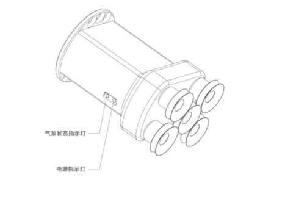



# 总体介绍
## 1.xArm真空吸头简要介绍

真空吸头可动态吸放光滑的平面物体，有效载荷≤5kg。真空吸头有5个吸盘，可根据吸放物体平面的大小相应减少吸盘，但要将其余不用的吸盘封住。

注意：如果是非光滑的平面，真空吸头漏气会导致不能将物体稳固地吸起。

指示灯状态：当真空吸头上电时，红色电源指示灯常亮。当气泵处于开启状态时，绿色气泵状态指示灯常亮。

## 1.2**设置与控制**

xArm真空吸头通过一条电缆直接供电和控制，该电缆用于24V直流供电和IO控制。
## 1.3**安全**

**警告**

操作员在使用xArm真空吸头之前必须已阅读并理解手册中的所有说明。

**注意**

术语“操作员”是指负责在xArm真空吸头上进行以下任何操作的任何人：

- 安装
- 控制
- 维护
- 检查
- 标定
- 编程
- 退役

本文档说明了xArm真空吸头从安装到运行再到使用的整个生命周期的一般操作。

本文档中的图形和照片是代表性的示例，它们与交付的产品之间可能存在差异。

### 1.3.1**警告**

**注意**

不遵守警告而使用真空吸头，可能导致操作人员受伤或设备损坏。

**警告**

在操作机器人之前，必须正确固定好真空吸头。

请勿安装或操作已损坏或缺少零件的真空吸头。

切勿为真空吸头通交流电。

确保所有接线端子稳定连接在机械臂和真空吸头两端。

请始终使用建议的电气连接。

在初始化机械臂程序之前，请确保没有人在机械臂和真空吸头路径中。

始终不要超过真空吸头的有效载荷。

根据您的应用情况，相应设置真空吸头的吸盘型号与数量。

接通电源时，手指和衣服应远离真空吸头。

请勿在人或动物身上使用真空吸头。

### 1.3.2**风险评估和最终应用** 

xArm真空吸头用于工业机器人，最终应用中使用的机器人、末端工具和任何其他设备必须进行风险评估。机器人集成商的责任是确保遵守所有本地安全措施和规定。根据不同的应用，可能存在需要采取额外保护/安全措施的风险，例如，真空吸头操作的工件可能对操作员具有固有的危险。

#### 1.3..3**用途**

xArm真空吸头用于吸取并临时固定或保持物体。

**警告**

真空吸头不适用于对物体或表面施加力。

该产品旨在安装在机器人或其他自动化设备上。

**信息**

始终遵守有关自动化安全和通用机器安全的本地和国家法律，法规和指令。

本设备只能在其技术数据范围内使用。产品的任何其他使用均被视为不当和意外使用。

对于因任何不当使用或不当使用引起的任何损坏，UFACTORY将不承担任何责任。
