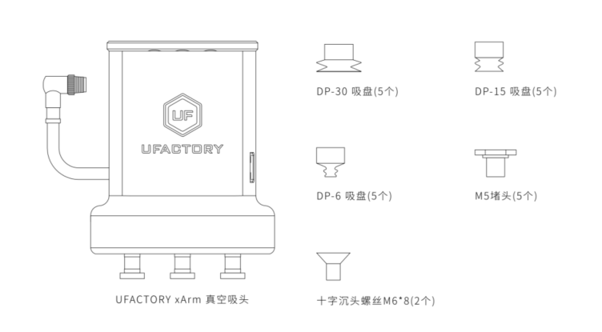
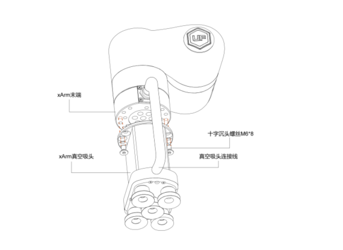
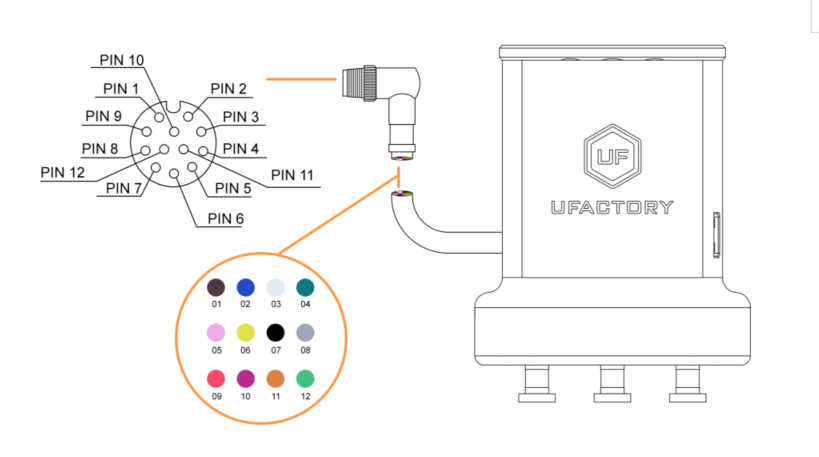

# 2.安装

以下小节将指导您完成xArm真空吸头的安装和常规设置。

（1）发货清单

（2）机械安装部分

（3）电气设置部分

**警告**

安装之前：

阅读并理解与xArm真空吸头有关的安全说明。

根据发货清单和订单验证包裹。

备有需求中列出的所需零件。

安装时：

满足环境条件。

在牢固地固定住xArm真空吸头并清除危险区域之前，请勿操作真空吸头或打开电源。
## 2.1 发货清单
### 2.1.1**通用套件**
xArm真空吸头套件通常包括以下物品（如下图所示）：

xArm真空吸头

十字沉头螺丝M6\*8（2个）

M5堵头（5个）

DP-6吸盘（5个）

DP-15吸盘（5个）

DP-30吸盘（5个）

通用套件图

## 2.2**机械安装**
xArm真空吸头安装步骤： 

1. 使机械臂运动到安全位置（避免碰到机械臂安装表面或者其他设备）； 
2. 机械臂断电（按下控制器急停按钮）； 
3. 用 2 颗 M6 螺丝把真空吸头固定在机械臂末端； 
4. 用真空吸头连接线连接机械臂和真空吸头；

注意： 

1. 接通真空吸头连接线时一定要使机械臂断电，急停开关处于按下状态，机械臂电源指示灯熄灭，避免热插拔引起机械臂故障；
2. 因真空吸头连接线长度限制，真空吸头接口与末端接口需在相同的方向；
3. 用连接线接通真空吸头跟机械臂时务必对齐两端接口的定位孔，连接线的公针较为纤细，避免在拆装时使公针弯曲。

## 2.3 **电气设置**

xArm真空吸头通过单根设备电缆与xArm机械臂建立电源和通信。设备电缆为真空吸头提供24V电源，并实现了与机械臂控制器的IO通信。

**警告：**

请断开机械臂电源后，再用真空吸头连接线将真空吸头和机械臂连接在一起。
### 2.3.1 **引脚接口**

xArm真空吸头通过位于其外表面上的12pin接头与机械臂工具端连接。

|序号|功能|
| :-: | :-: |
|1|24V|
|2|24V|
|3|GND|
|4|GND|
|5|485-A（未使用）|
|6|485-B（未使用）|
|7|Digital Input 0|
|8|Digital Input 1|
|9|Digital Output 0|
|10|Digital Output 1（未使用）|
|11|No Connect（未使用）|
|12|No Connect（未使用）|

