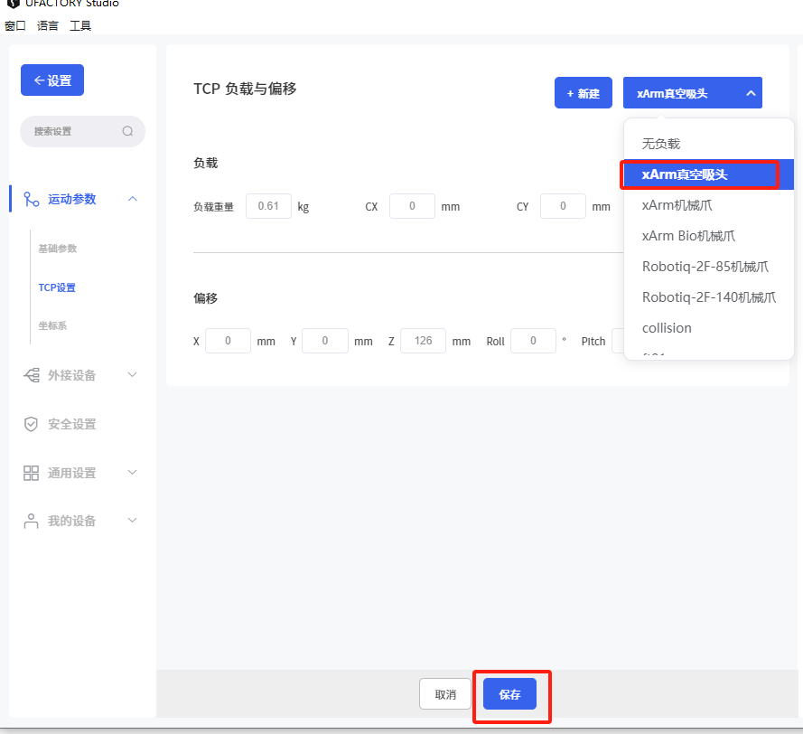
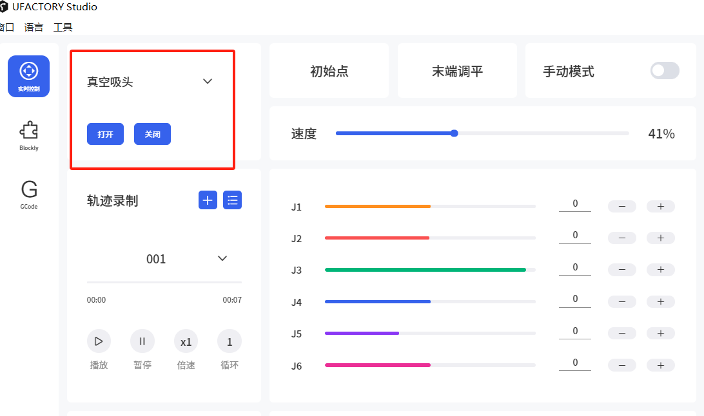
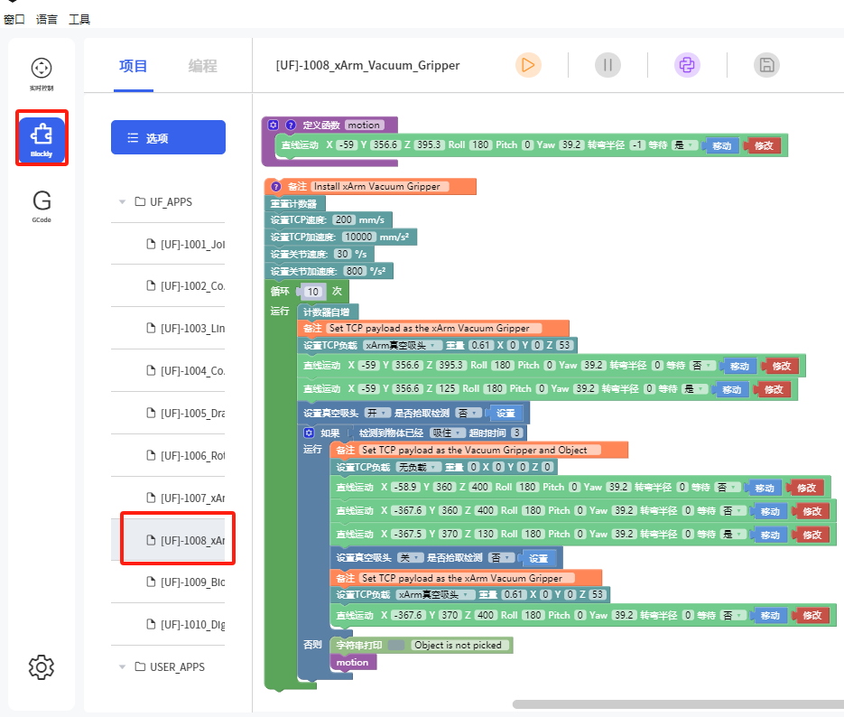

# 3.**xArm真空吸头的控制方式**
## 3.1**用 xArm Studio控制xArm真空吸头**
1. **设置xArm真空吸头**
进入设置-运动参数-TCP设置



安装真空吸头后，设置Tcp负载和偏移，选择xarm真空吸头，并保存.当真空吸头吸取物体后，其重量发生变化，则需要设置新的TCP负载
2. **控制xArm真空吸头**
- 1.在实时控制界面控制xArm真空吸头
控制方法：
在实时控制页面控制真空吸头，通过点击【打开】/【关闭】按钮，来控制真空吸头的打开和关闭。



- 2.通过Blockly编程来控制xArm真空吸头
在blockly模块中找到文件1008_xArm_Vacuum_Gripper



这段程序的作用：执行此程序，可控制真空吸头在指定位置吸取目标物，然后将目标物放到特定的位置。
注意：
1）当真空吸头安装到机械臂上时，在Blockly程序中应当设置TCP负载，当真空吸头吸取物体后，其重量发生变化，则需要设置新的TCP负载。
## 3.2**用 Python-SDK 控制xArm真空吸头**
真空吸头的使用接口：
```
arm.set\_vacuum\_gripper(True, wait=False)    #开启真空吸头 

arm.set\_vacuum\_gripper(False, wait=False)   #关闭真空吸头 
```
Python-SDK下载地址:
https://github.com/xArm-Developer/xArm-Python-SDK
## 3.3. **用 ROS-SDK 控制xArm真空吸头**
请参照ROS包中附带的ReadMe文件中的第5.7.8节来控制真空吸头的打开和关闭。
ROS-SDK下载地址:
https://github.com/xArm-Developer/xarm_ros
## 3.4 **用Modbus TCP通信协议控制xArm真空吸头**
本节主要阐述了如何通过调用xArm控制器的Modbus-TCP协议来控制xArm真空吸头。
### 3.4.1 **Modbus TCP通信协议**
**Modbus-TCP：**
Modbus协议是一项应用层报文传输协议，有ASCII、RTU、TCP三种报文类型。标准Modbus协议物理层接口有RS232、RS422、RS485和以太网接口，采用master/slave方式通信。
**Modbus  TCP通信过程：**
1. 建立TCP连接
2. 准备modbus报文
3. 使用send命令发送报文
4. 在同一连接下等待应答
5. 使用recv命令读取报文，完成一次数据交换
6. 通信任务结束时，关闭TCP连接
**参数：**
默认TCP端口：502           协议标识：0x00 0x02 控制(当前只有这一个)
**关于用户使用通信协议组织数据的大小端问题：**
在本章节中，数据解析均为大端解析。
### 3.4.2 **真空吸头的控制**
- **打开/关闭真空吸头**
可以通过发送下面的指令来控制真空吸头的打开和关闭。

| **打开真空吸头** | 00 01 00 02 00 08 7F 09 0A 15 00 80 80 4300 01 00 02 00 08 7F 09 0A 15 00 00 00 44 |
| ------------- | ------------------------------------------------------------ |
| **关闭真空吸头** | 00 01 00 02 00 08 7F 09 0A 15 00 00 80 4300 01 00 02 00 08 7F 09 0A 15 00 80 00 44 |

具体参数请参照下面的表格。

| **设置末端数字量输出** |                                                              |         |      |                     |
| ---------------------- | ------------------------------------------------------------ | ------- | ---- | ------------------- |
| **寄存器：127 (0x7F)** |                                                              |         |      |                     |
| **请求指令格式**       |                                                              |         |      |                     |
| Modbus TCP 包头        | 事务标识                                                     | 2 Bytes | u16  | 0x00,0x01           |
|                        | 协议                                                         | 2 Bytes | u16  | 0x00,0x02           |
|                        | 长度                                                         | 2 Bytes | u16  | 0x00,0x08           |
|                        | 寄存器                                                       | 1 Byte  | u8   | 0x7F                |
| 参数                   | 主机ID                                                       | 1 Byte  | u8   | 0x09                |
|                        | 寄存器起始地址                                               | 2 Bytes | u16  | 0x0A,0x15           |
|                        | 参数1（打开0）数据256.0：关闭0；257.0：打开0；512.0：关闭1；514：打开1 | 4 Bytes | fp32 | 0x00,0x80,0x80,0x43 |
| **响应指令格式**       |                                                              |         |      |                     |
| Modbus TCP 包头        | 事务标识                                                     | 2 Bytes | u16  | 0x00,0x01           |
|                        | 协议                                                         | 2 Bytes | u16  | 0x00,0x02           |
|                        | 长度                                                         | 2 Bytes | u16  | 0x00,0x02           |
|                        | 寄存器                                                       | 1 Byte  | u8   | 0x7F                |
| 参数                   | 状态                                                         | 1 Byte  | u8   | 0x00                |

- **获取真空吸头的状态**

获取真空吸头状态的步骤见下表：

可以通过发送下面的请求指令来获取真空吸头的状态。

|         **获取状态（请求指令）**          | 00 01 00 02 00 04 80 09 0A 14      |
|:-------------------------------:|------------------------------------|
| **获取状态（响应指令）**  **（真空吸头已吸取物体）** | 00 01 00 02 00 06 80 00 00 00 00 01 |
| **获取状态（响应指令）**  **（真空吸头未吸取物体）** | 00 01 00 02 00 06 80 00 00 00 00 00 |

具体参数请参照下面的表格。

| **获取末端数字量输入** |                                                              |         |      |                     |
| ---------------------- | ------------------------------------------------------------ | ------- | ---- | ------------------- |
| **寄存器：128 (0x80)** |                                                              |         |      |                     |
| **请求指令格式**       |                                                              |         |      |                     |
| Modbus TCP 包头        | 事务标识                                                     | 2 Bytes | u16  | 0x00,0x01           |
|                        | 协议                                                         | 2 Bytes | u16  | 0x00,0x02           |
|                        | 长度                                                         | 2 Bytes | u16  | 0x00,0x04           |
|                        | 寄存器                                                       | 1 Byte  | u8   | 0x80                |
| 参数                   | 主机ID                                                       | 1 Byte  | u8   | 0x09                |
|                        | 寄存器起始地址                                               | 2 Bytes | u16  | 0x0A,0x14           |
| **响应指令格式**       |                                                              |         |      |                     |
| Modbus TCP 包头        | 事务标识                                                     | 2 Bytes | u16  | 0x00,0x01           |
|                        | 协议                                                         | 2 Bytes | u16  | 0x00,0x02           |
|                        | 长度                                                         | 2 Bytes | u16  | 0x00,0x06           |
|                        | 寄存器                                                       | 1 Byte  | u8   | 0x80                |
| 参数                   | 状态                                                         | 1 Byte  | u8   | 0x00                |
|                        | 参数1（0）最末端字节，表示输入状态。第0位对应输入0，第1位对应输入1。 | 4 Bytes | u8*4 | 0x00,0x00,0x00,0x00 |


